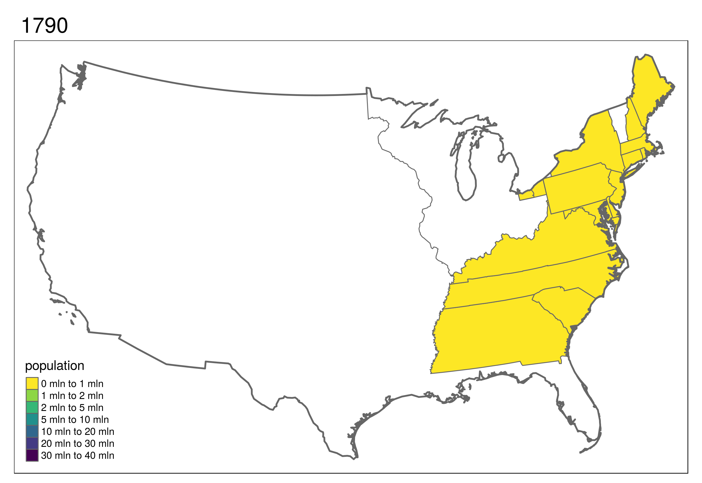
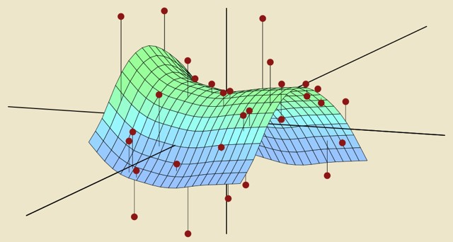

class: center
#  Visualize your data
```{r}
knitr::include_graphics("images/animated.gif")
```

---
# Create maps!

---


# Statistics and machine learning
```{r, echo=F}


```
---

# Programmatically generate tables


```{r}
tableone::CreateTableOne(
  vars =  c("time","status","age","sex","trig","stage"), 
  strata = "trt", data = survival::pbc, 
  factorVars =  c("status","trt","edema","stage"))
```


---
class: center, middle
# **MMC R server** 
## Access your work from any MaineHealth computer with a web browser
**[https://vmrstudiowebap](https://vmrstudiowebap)**

---
class: center, middle
# **MMC R server** 
## Install packages with ease


```{r eval=FALSE, tidy=FALSE}
install.packages("tidyverse")
```


---
class: center, middle
# **MMC R server** 
## Use Python
```{python}
import pandas as pd
my_series = pd.Series([2, 4, 6, 8, 10])
print(my_series.describe())
```
---
class: center, middle
# **MMC R server** 
## Connect to databases
```{r, eval=FALSE}
con <- dbConnect(odbc(), Driver = "{ODBC Driver 17 for SQL Server}", 
    Server = "localhost", Database = "testdb", UID = "SA", PWD = rstudioapi::askForPassword("Database password"), 
    Port = 1433)
```


---
# **MMC R user group**
- Get help from peers
- Meets first Tuesday of every month at CORE
- Upcoming topics
  * Programmatic tables
  * Baysian multilevel modeling
  * Causal inference and Structural Equation Modeling
  * Big data
---
class: center

# Data Carpentry Workshop at CORE

<iframe width="700" height="450" src="https://www.youtube.com/embed/yK2vexb2QEI" frameborder="0" allow="accelerometer; autoplay; encrypted-media; gyroscope; picture-in-picture" allowfullscreen></iframe>

---
class: center
background-image: url("images/publish.gif")

# **RStudio Connect:** Share your analysis
Publish your analysis and share internally via a simple url


